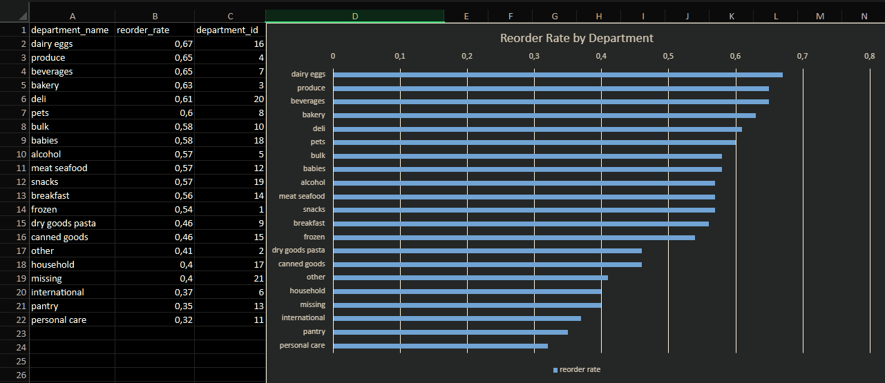
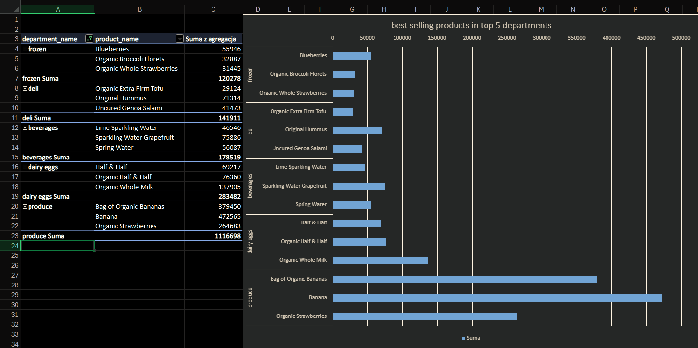
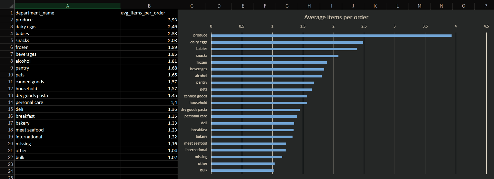
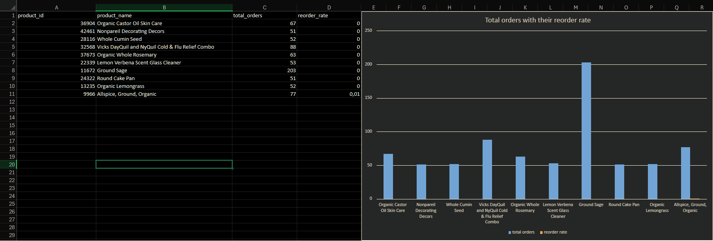
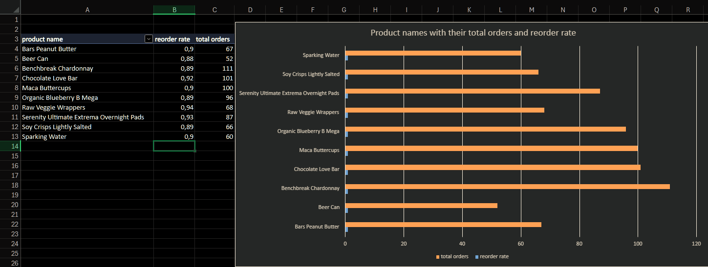

# Which Product Categories Drive Repeat Purchases? — Instacart Order Analysis

## Problem

Which product categories drive the most repeat (reorder) behavior among Instacart customers, and what does that mean for inventory and promotional priorities?

## Data

- Source: [Instacart Market Basket Analysis dataset (Kaggle)](https://www.kaggle.com/datasets/psparks/instacart-market-basket-analysis)
- Tables used: `order_products_prior` (32,434,489 rows), `products`, `departments`
- Scope: all prior orders across all users and departments

## Approach

- SQL (PostgreSQL) for all aggregations, rankings, and filtering — queries are in [`/queries`](./queries)
- Excel for visualization (pivot tables, bar charts) — full workbook: [`instacart-analysis.xlsx`](./instacart-analysis.xlsx)

---

## Question 1: Reorder Rate by Department



Essential, frequently-consumed products (dairy eggs, produce, beverages) have the highest reorder rate, while one-time-purchase categories (personal care, pantry) have the lowest. Customers return to these staple categories consistently, while categories like personal care are bought less predictably.

**Recommendation:** Prioritize inventory availability and loyalty promotions in high-reorder categories (dairy eggs, produce, beverages), since demand there is recurring and predictable.

---

## Question 2: Top 3 Products from top 5 departments



Each department's top sellers reflect its category clearly — organic whole milk dominates dairy eggs, bananas dominate the produce department, and sparkling/mineral waters dominate beverages. Demand within several departments (notably produce) is heavily concentrated around a handful of bestselling items.

**Recommendation:** These bestsellers are strong candidates for guaranteed stock availability and feature placement, since a small number of products account for a disproportionate share of orders in their category.

---

## Question 3: Average Basket Size by Department



Produce (3.93 items) and dairy eggs (2.49 items) have both the largest average basket size and the highest reorder rate, confirming they are the core repeat-purchase categories. Categories like bulk and other have both small baskets and low reorder rates — infrequent, low-volume purchases.

**Recommendation:** Produce and dairy eggs are the clear priority for inventory management and loyalty-focused promotions, since customers buy them in volume and return to them regularly.

---

## Question 4: Basket Size Distribution

Average basket: **10.09 items** | Median: **8 items** | Min: 1 | Max: 145

The gap between the average and the median indicates a right-skewed distribution: most orders are modest in size (around 8 items), while a small number of unusually large orders (up to 145 items) pull the average upward.

**Recommendation:** For planning purposes (e.g. checkout UX, logistics), the median (8 items) better represents a "typical" order than the average, which is distorted by outliers.

---

## Question 5: Products with the Highest and Lowest Reorder Rates

*(minimum 50 orders per product, to exclude statistically unreliable small samples)*




Products with the lowest reorder rate are almost exclusively one-time or infrequent purchases: skin care oil, cake decorations, bulk spices (cumin, rosemary, sage), glass cleaner, a cake pan, and cold/flu medicine. All have a reorder rate near 0 — customers buy them once and don't need them again soon.

Notably, "Ground Sage" has an unusually high order count (203) despite a 0% reorder rate — popular among many different customers, but not repurchased by any of them, likely reflecting occasional/seasonal use.

**Recommendation:** For this group, a "reminder to reorder" strategy won't work. Cross-selling with complementary products, or first-purchase promotions, are a better fit than loyalty-based tactics.

---

## Overall Recommendations

1. **Prioritize produce, dairy eggs, and beverages** for inventory and loyalty promotions — they combine the highest reorder rates with the largest basket sizes.
2. **Use cross-selling, not reorder reminders, for low-reorder categories** like personal care and pantry — these are one-time or infrequent purchases by nature.
3. **Plan around the median basket size (8 items), not the average (10.09)**, to avoid over-provisioning for atypical large orders.

---

Bonus: Power BI Dashboard

The same analysis was also built as an interactive Power BI dashboard using DAX measures, demonstrating the average item count per order in each department and reorder rate.
     


## Folder Structure

```
├── README.md
├── instacart-analysis.xlsx
├── instacart-analysis.pbix
├── queries/
│   ├── q1_reorder_rate.sql
│   ├── q2_top_3_p.sql
│   ├── q3_avg_items_per_order.sql
│   ├── q4_basket_size.sql
│   └── q5_highest_reorder_rate.sql
│   └── q5_lowest_reorder_rate.sql
└── charts/
    ├── q1_reorder_rate.png
    ├── q2_top_3_p.png
    ├── q3_avg_items_per_order.png
    ├── q5_lowest_reorder_rate.png
    └── q5_highest_reorder_rate.png
```
